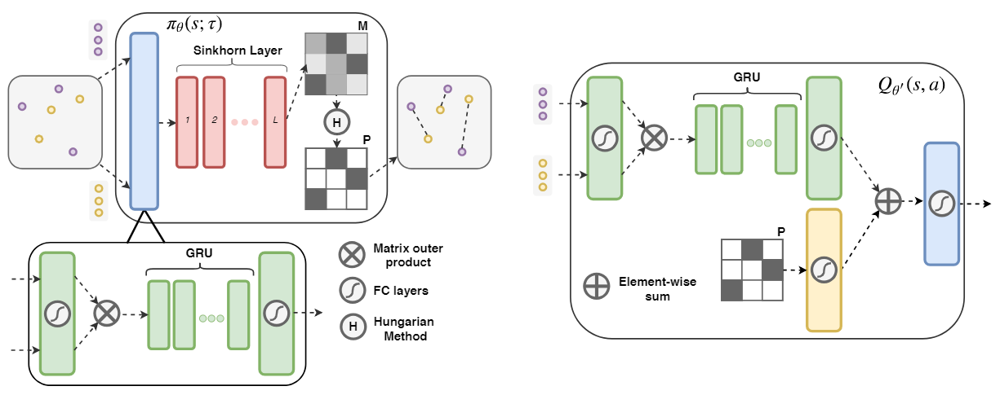

# sinkhorn-policy-gradient.pytorch

This repository contains code accompanying [Learning Permutations with Sinkhorn Policy Gradient](https://arxiv.org/abs/1805.07010) that can be used to replicate the experiments for sorting with N={20,50}, maximum weight matching with N={10,15,20,25}, and the Euclidean TSP with N=20. 

## What is Sinkhorn Policy Gradient? 

SPG is an off-policy actor-critic deterministic policy gradient algorithm. It can be used to train the SPG+Matching and SPG+Sequential deep network architectures from the paper to solve combinatorial optimization problems involving permutations. 



## Dependencies

* [PyTorch 0.4](https://pytorch.org)
* h5py
* tqdm
* tensorboard_logger
* pathos
* scikit-learn (0.19.1)
* cython

## Build

To compile the cython code for the Hungarian algorithm, run

    ```python setup.py build_ext --inplace; mv build/ spg/; mv *.so spg/```

## Data

Download the data used for all experiments in the paper [here](https://www.dropbox.com/sh/voi1jsqz6sj7vle/AAA97tcZwRITrEm67r3OFSYea?dl=0).
Create a directory called `data` in the base directory of the repo, and unzip the three zip files there.

For sorting and Euclidean TSP, a train and test dataset will automatically be created if you try to run an experiment without the dataset existing in the required folder. For MWM, you can set a variable (see below) to optionally force the creation of new train/test/val datasets.

## Running the experiments

Scripts for training and evaluating models are in the `scripts/` directory. To run an experiment, modify the variables in the `run_spg.sh` or `run_pnac.sh` file. I prefer this extra layer around `argparse` so you don't have to deal with typing the long list of command line arguments. I will briefly explain the important variables here.

n.b. I have `--_id` set up with argparse for [FGMachine](https://github.com/Kaixhin/FGMachine).

### SPG (run_spg.sh)
* `N_NODES` Sets the problem size.
* `N_FEATURES` Feature dimension of problem instance.
* `COP` The **C**ombinatorial **O**ptimization **P**roblem. Choose from {mwm2D_$N_NODES, sort_0-19, sort_0-49, tsp_$N_NODES}.
* `ACTOR_WORKERS` The number of cores to split the batch of problem instances across for parallel Hungarian method.
* `ARCH` Choose from {sequential, matching}.
* `RANDOM_SEED` Passed as CLI argument to `run_spg.sh`, e.g, `./run_spg.sh 1234`.
* `RUN_NUM` Passed as CLI argument to `run_spg.sh`, e.g., `./run_spg.sh 1234 -1`.
* `PARALLEL_ENVS` Number of problem instances in each batch in the forward pass.
* `BATCH_SIZE` Number of problem instances to use in each backwards pass minibatch for gradient estimation.
* `N_EPOCHS` Number of passes of the training set.
* `DISABLE_TENSORBOARD` Don't log tensorboard outfile.
* `RNN_DIM` Hidden layer dim for the GRU. Automatically doubled for the bidirectional GRU in SPG+Sequential.
* `CUDA_DEVICE` Set the GPU device ID, default is 0.
* `REPLAY_BUFFER_GPU` Store the replay buffer on the GPU or on the CPU (requires passing more tensors back and forth but can use system RAM).
* `SAVE_STATS` Store rewards to a h5py file and store test scores to a json file for [FGLab](https://kaixhin.github.io/FGLab/).
* `SAVE_MODEL` Save model weights after each epoch.
* `BASE_DIR` The directory where logs, models, fglab results, etc. will be saved.
* `MAKE_DATASETS` For creating more data for sorting, mwm2D, or E-TSP. ['None', 'all', 'train', 'val', 'test']

#### SPG Examples

sort-20:
```
N_NODES=20
N_FEATURES=1
COP='sort_0-19'
ARCH='sequential'
```

mwm2D-10:
```
N_NODES=10
N_FEATURES=2
COP="mwm2D_$N_NODES"
ARCH='matching'
```

tsp-20:
```
N_NODES=20
N_FEATURES=2
COP="tsp_$N_NODES"
ARCH='sequential'
```

### PN-AC, PN-AC+Matching, AC+Matching (run_nco.sh)
* `INPUT_SIZE` Sets the problem size.
* `TASK` Equivalent to `COP`.
* `USE_DECODER` Set to `True` for PN-AC (non-matching tasks) and PN-AC+Matching (matching tasks), and `False` for AC+Matching.
* `N_GLIMPSES` The glimpse attention module in the pointer network. Default is 1 "glimpse" over the input sequence.
* `USE_TANH` Apply `tanh` and multiply the logits by 10 in the attention layer in the pointer network, from Bello et. al. 2017.
* `CRITIC_BETA` EMA beta hyperparameter. Default is 0.8.

## Adding new environments

See the `env` directory and create a new file `yournewenv_task.py` that follows the structure of `sorting_task.py`. Basically, there should be a `create_dataset(...)` function, an `EnvDataset` class extending `Dataset`, and a `reward` function. Then, modify `envs/dataset.py` so that, if the `COP` or `TASK` is set to the name of the new env, the `build(args, ...)` function in `envs/dataset.py` will appropriately set the `env`, `training_dataloader`, and `test_dataloader` variables that it returns from `yournewenv_task.py`. The `env` variable here is just an alias for `yournewenv_task.reward`. 

## Licensing

Please read and respect the license. :)

## Citations

Use this citation for the paper: 

```
@article{emami2018learning,
   title = {Learning Permutations with Sinkhorn Policy Gradient},
   author = {Emami, Patrick and Ranka, Sanjay},
   journal = {arXiv:1805.07010 [cs.LG]},
   year = {2018}
```

If you use or modify this code for your work, please use the following citation:

```
@misc{emami2018spg,
  title = {sinkhorn-policy-gradient.pytorch}, 
  author = {Emami, Patrick and Ranka, Sanjay},
  howpublished = {\url{https://github.com/pemami4911/sinkhorn-policy-gradient.pytorch}},
  note = {Accessed: [Insert date here]}
}
```
